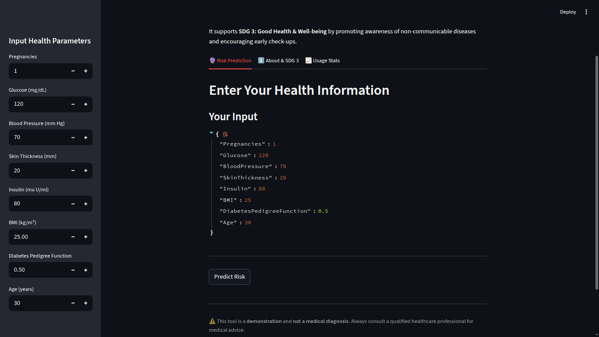
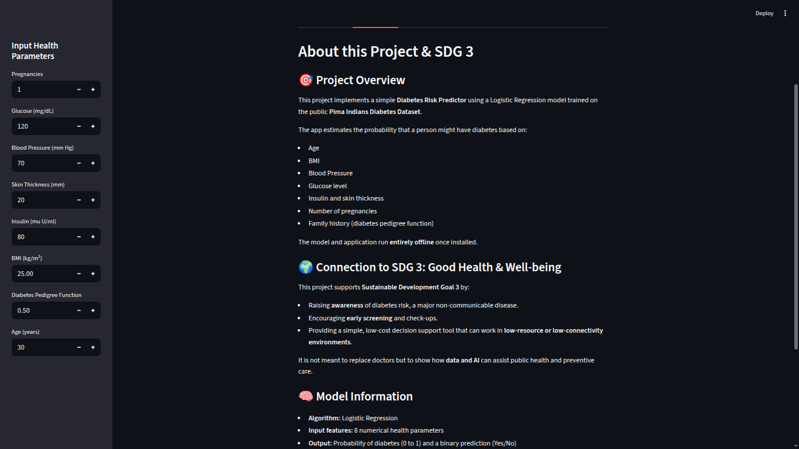
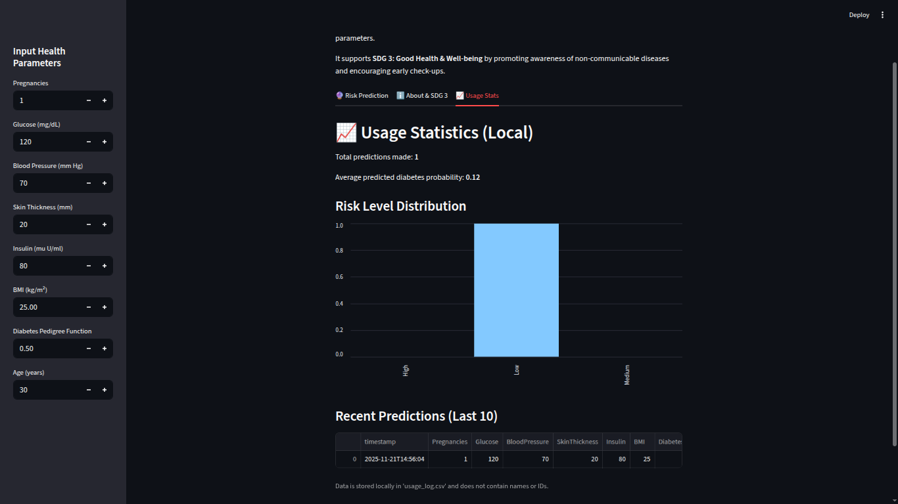

# 🩺 Diabetes Risk Predictor (SDG 3 – Good Health & Well-being)

This project is a simple **offline health risk prediction tool** that estimates the risk of **type 2 diabetes** using basic health parameters. It uses a **Logistic Regression** model trained on the **Pima Indians Diabetes Dataset** and a **Streamlit** web app for interaction.

The app supports **Sustainable Development Goal 3 (SDG 3): Good Health & Well-being** by:

- Raising awareness about diabetes risk  
- Encouraging early screening and preventive behaviour  
- Demonstrating how low-cost, offline AI tools can support health decision-making  

> ⚠️ **Disclaimer:** This project is for **education and demonstration only**.  
> It is **NOT** a medical device and must **not** be used for real diagnosis or treatment.

---
## [PitchDeck](https://diabetes-risk-predictor-fvl7hbm.gamma.site/)
## 🖼️ Screenshots

### 1. Risk Prediction Tab



---

### 2. About & SDG 3 Tab



---

### 3. Usage Stats Tab




## 🗂️ Project Structure

```text
diabetes_project/
  ├── screenshots/
  │   ├── prediction_tab.png
  │   ├── about_tab.png
  │   └── usage_stats_tab.png
  ├── app.py
  ├── train_model.py
  ├── diabetes_model.pkl
  ├── diabetes.csv
  └── README.md

---

## 💻 1. Requirements

You need:

* **Python 3.8+**
* Recommended: a virtual environment (optional but clean)

Install the required Python packages:

```bash
pip install streamlit scikit-learn pandas numpy
```

---

## 📥 2. Dataset

This project uses the **Pima Indians Diabetes Dataset**.
Make sure you have a file named **`diabetes.csv`** in the project folder with columns like:

* `Pregnancies`
* `Glucose`
* `BloodPressure`
* `SkinThickness`
* `Insulin`
* `BMI`
* `DiabetesPedigreeFunction`
* `Age`
* `Outcome` (0 = no diabetes, 1 = diabetes)

> If you downloaded the dataset from Kaggle or GitHub, just rename the CSV to `diabetes.csv` and place it in the same folder as `train_model.py`.

---

## 🧠 3. Training the Model

Run the training script to:

* Load and clean the dataset
* Split it into train/test sets
* Train a **Logistic Regression** model
* Save the model and scaler into `diabetes_model.pkl`

From the project folder, run:

```bash
python train_model.py
```

You should see output including:

* Accuracy on the test set
* Classification report
* Confusion matrix
* A message like: `Model saved to diabetes_model.pkl`

After this, you should have:

```text
diabetes_model.pkl
```

in your folder.

---

## 🌐 4. Running the Streamlit App

Once the model file (`diabetes_model.pkl`) exists, start the app with:

```bash
streamlit run app.py
```

This will open the app in your browser at:

```text
http://localhost:8501
```

The app has **three main tabs**:

### 🔮 Risk Prediction

* Enter your health parameters in the **sidebar**:

  * Pregnancies
  * Glucose (mg/dL)
  * Blood Pressure (mm Hg)
  * Skin Thickness (mm)
  * Insulin (mu U/ml)
  * BMI (kg/m²)
  * Diabetes Pedigree Function
  * Age (years)
* Click **“Predict Risk”**.
* The app will display:

  * A prediction (low diabetes risk vs diabetes risk)
  * Estimated **probability** of diabetes (0–1)
  * A **risk level**: Low / Medium / High
  * General, non-medical **health tips** and a disclaimer

All predictions are made **locally and offline** using the saved model.

### ℹ️ About & SDG 3

This tab explains:

* The goal of the project
* Connection to **SDG 3: Good Health & Well-being**
* Basic information about the dataset and model
* Important disclaimer: the app is **not** a diagnostic tool

This is useful for reports, presentations, or anyone viewing the project for the first time.

### 📈 Usage Stats

Each time the user makes a prediction, the app logs it to **`usage_log.csv`** (created automatically).
The log *does not* contain any names or IDs, just:

* Timestamp
* Input health parameters
* Predicted class
* Probability
* Risk level (Low/Medium/High)

The **Usage Stats** tab shows:

* Total number of predictions
* Average predicted probability of diabetes
* A **bar chart** of risk levels (Low/Medium/High)
* A table showing the **last 10 predictions**

> If `usage_log.csv` does not exist yet, the tab will show a message asking you to make some predictions first.

---

## 🧪 5. How It Works (Technical Overview)

1. **Data Preprocessing**

   * Load `diabetes.csv` using `pandas`.
   * Replace unrealistic zeros in:

     * `Glucose`, `BloodPressure`, `SkinThickness`, `Insulin`, `BMI`
   * Impute these with the **median** of each column.
   * Separate features (**X**) and target (**y = Outcome**).

2. **Train–Test Split**

   * Split data into **80% training** and **20% testing**.
   * Use stratified sampling to maintain class balance.

3. **Scaling**

   * Use `StandardScaler` to scale the features.
   * Fit on training data, transform both train and test, and later user input.

4. **Model**

   * Use **Logistic Regression** (`sklearn.linear_model.LogisticRegression`).
   * Train on the scaled training data.
   * Evaluate on the test set (accuracy, precision, recall, etc.).

5. **Saving Model**

   * Save a Python dictionary containing:

     * `model` – the trained Logistic Regression model
     * `scaler` – the fitted StandardScaler
     * `feature_names` – list of feature names
   * Use `pickle.dump()` to store it in `diabetes_model.pkl`.

6. **Streamlit App**

   * Load `diabetes_model.pkl` at startup.
   * Collect user input via Streamlit widgets in the sidebar.
   * Convert input to a NumPy array, scale with the loaded scaler.
   * Call `model.predict()` and `model.predict_proba()` to generate predictions.
   * Display results + risk levels + health tips.
   * Log each prediction to `usage_log.csv` for stats.

---

## 📊 6. Example Output / Metrics

When you run `train_model.py`, you’ll get evaluation metrics on the test set, such as:

* Test accuracy (e.g., ~0.75–0.80)
* Precision and recall for both classes
* Confusion matrix

You can copy these results into your **report** or **presentation**.

---

## 🌍 7. SDG 3 – Good Health & Well-being

This project demonstrates how AI and simple web tools can support:

* **Awareness** of non-communicable diseases (like diabetes)
* **Early screening mindset**, by prompting users to think about risk
* **Low-cost, offline tools** that can be run anywhere with a laptop

Even though this tool is **not** clinically validated, it illustrates important ideas behind using data and machine learning to support **public health**, linking directly to **SDG 3**.

---

## ⚠️ 8. Limitations

* Dataset is limited to a specific population (Pima Indian women).
* Only 8 numerical features are used. Real diagnosis requires more data and clinical judgement.
* Logistic Regression is simple and may not be the most accurate possible model.
* The model is **not clinically validated** and must **not** be used for real patient care.

---

## 🔮 9. Possible Future Improvements (Optional)

These are ideas only – not implemented in this version:

* Try and compare other models (e.g., Random Forest, Gradient Boosting).
* Add more visual explanations for how each feature affects the prediction.
* Extend the app to predict risk for other diseases (e.g., heart disease).
* Improve content and explanations for different audiences.
* Add support for multiple languages.

---

## ✅ 10. How to Run (Quick Steps)

1. Clone or copy this project folder.

2. Place `diabetes.csv` in the project folder.

3. Install dependencies:

   ```bash
   pip install streamlit scikit-learn pandas numpy
   ```

4. Train the model:

   ```bash
   python train_model.py
   ```

5. Run the app:

   ```bash
   streamlit run app.py
   ```

6. Open your browser at `http://localhost:8501` and start exploring.

